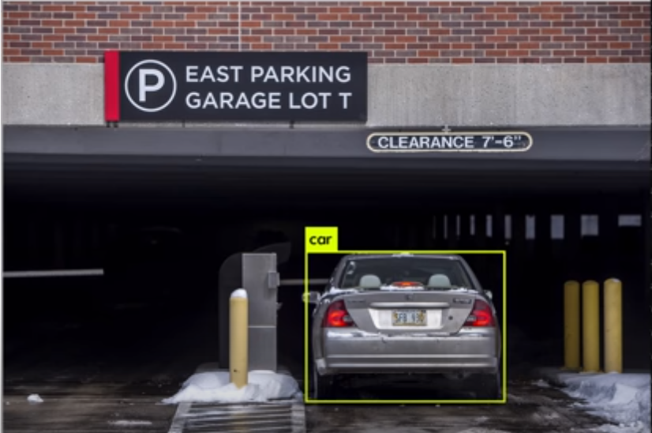
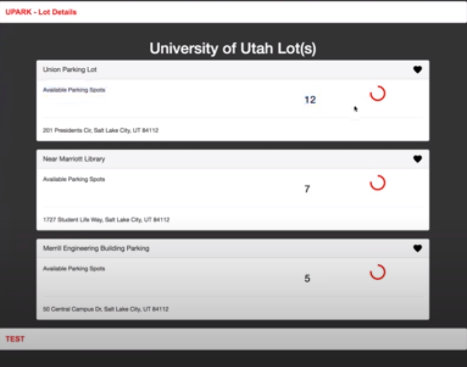
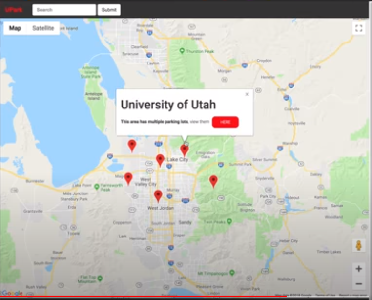

Winning project at HackTheU 2018, a Major League Hacking competition. 

This is a computer vision assisted Java web application for finding and counting available parking spaces at your favorite parking lot facilities. Makes use of darknet open source nueral network to assist in the discovery of automobiles entering and exiting from parking lots to track lot space availability. 

Data from the vision tallies are sent via REST to Google Cloud Platform. The data is displayed using a web application that utilizes Google Maps API.

Credits
-----

Darknet: Open Source Neural Networks in C - Joseph Redmon

https://pjreddie.com/darknet/yolo/ 

